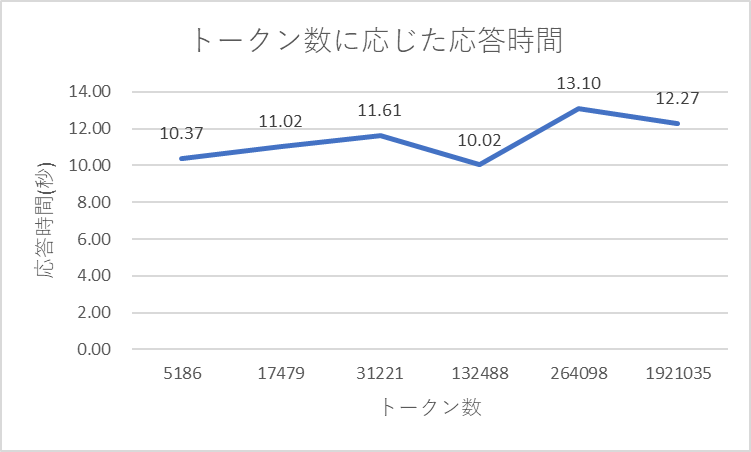
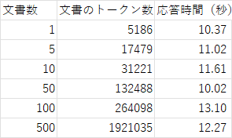

## 目的
インデックス化する文量がLlama IndexとLang Chainに対して与える影響を検証します．

## 検証環境
### ChatGPT
* モデル：`gpt-3.5-turbo`

### Lang Chain
* エージェント：`zero-shot-react-description`
* ツール
  - `command_predictor`
    * Llama Indexで実装
    * ユーザーの要望を満たすAWSコマンドを表示します．
  - `parameter_predictor_from_query`
    * Llama Indexで実装
    * ユーザーの質問文中から、AWSコマンドに必要な引数を抽出して表示します．引数が見つからない場合は、ユーザーに引数が見当たらない旨を通知します．

### Llama Index
* インデックス化手法：`GPTVectorStoreIndex`

## 検証手法
* AWS CLIのサブコマンドの文書（以下「文書」）をインデックス化する．
* 文書はすべてで`13698`件存在する(恐ろしい)．
* インデックス化するtoken数に応じて、次の項目に関してどんな変化が起きるのかを検証する．
* ソースコードの収集は[こちらのコード](./collect_aws_command_ref.py)を使用
* 検証コードの実行コマンド
  ```bash
  streamlit run  validate_single_document.py -- --max-urls <インデックス化する文書数>
  ```

1. 質問から応答までの時間
   - `1`, `5`, `10`, `100`, `500`件の文書にインデックス化処理を行う．
   - 各インデックスを使い、Lang Chainのエージェントにそれぞれ同一の質問を行い、その応答時間を計測する．
   - トークン数は、正確を期すためopenai公式の`tiktoken`ライブラリを使用

2. 主観による対話の精度
   - `1`, `5`, `10`, `100`, `500`件の文書にインデックス化処理を行う．
   - 各インデックスを使い、Lang Chainのエージェントにそれぞれ同一の質問を行い、その返答を検証する．

## 検証結果
### 質問から応答までの時間

* 下記のグラフは、各文書数に応じたトークン数に対する応答時間の関係を示したもの．

  

* 下記の表は、グラフの元となるもの．各文書数に含まれるトークン数をそれぞれ示している．

  

* 考察
  - 文書数とトークンの関連
    - １文書あたり平均4000トークン程度持つ．
  - トークン数と応答時間の関連
    - いずれのトークン数においても応答時間を10秒を下回らない．
    - トークン数を指数関数的に増加させたととき、若干の応答時間の増加は認められるが線形的でない．
    - 外的な要因（レイテンシ、APIの繁閑等）による応答時間への影響が強く出ていると考えられる．

---
### 主観による対話の精度
* 各文書件数に対し、下記の質問を行ったが、すべて下記の応答をした．

  質問
  ```
  EC2のインスタンス名を列挙するAWSコマンドを教えて。
  ```

  応答
  ```
  The AWS command to list EC2 instance names is describe-instances.
  ```

* 考察
  - `gpt-3.5-turbo`の日本語翻訳のfine-tuningが追いついていないためか、返答は英語
  - 文書数に依らず`describe-instances`のサブコマンドを正確に抽出

---
## まとめと感想
* 当検証では最大文書数500件に対して、廉価な`gpt-3.5-turbo`を用いたインデックス化を試み、以下の検証結果を得た．
  - 応答時間は最小文書数（1件）と最大文書数（500件）で数秒の違いしかなかった．
  - 対話精度は文書数に依らず、同一であり、ユーザの所望する回答を得ることができた．
  - 上記より、インデックス化は`gpt-3.5-turbo`で十分
  - 上記より、対話応答の精度は`gpt-3.5-turbo`では不十分(オプションを含めた返答、日本語対応という観点から)

* 検証結果より、運用という文脈ではインデックス化は廉価な`gpt-3.5-turbo`を使い、対話応答は安定的な日本語回答可能な`gpt-4`を使用するのが良いのではないか．

* 今後の検証の方向性
  - 全文書（`13698`件）に対して`gpt-3.5-turbo`を使ってインデックス化し、下記の検証を実施
    * 応答時間
    * 対話精度
  - `gpt-3.5-turbo`をインデックス化に使用、`gpt-4`を対話に使用できるか検証
